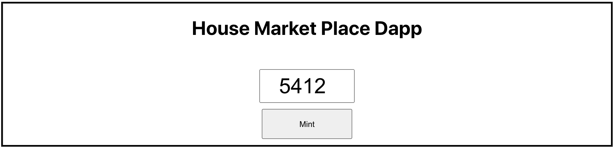
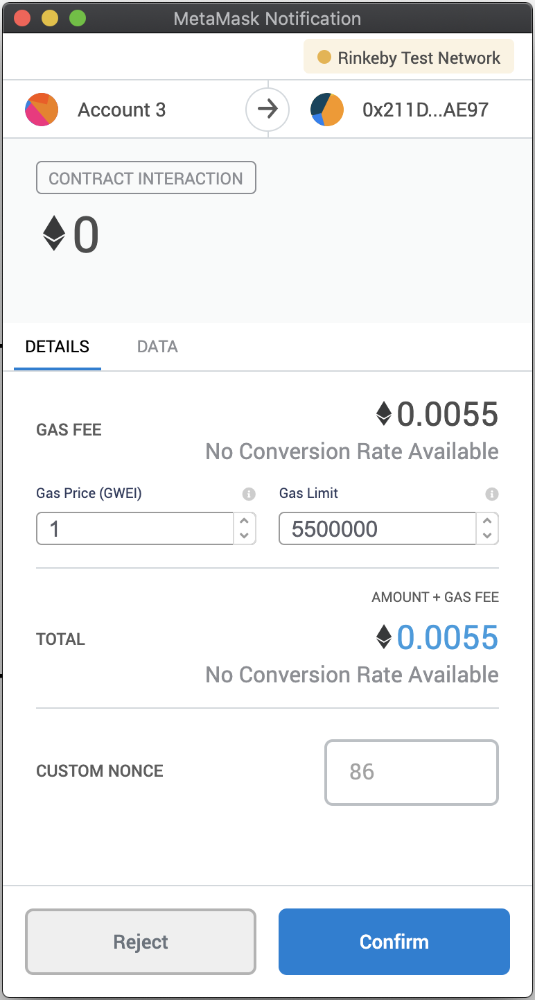

# Udacity Blockchain Capstone

The capstone will build upon the knowledge you have gained in the course in order to build a decentralized housing product. 

## Testing
```bash
truffle test
```

## Deploy
This command recompiles and deploy smart contract to the Rinkeby network.
```bash
truffle migrate --network rinkeby  --reset --compile-all
```

## Token minting and contract deployment

```bash
Verifier: 0xE95352a83b9799fBe69C14e1e794601AEc7D1b81
SolnSquareVerifier: 0xD0d72096e35e09DAeFf92c25327FB14F40fC1B65
```

## Minting
```bash
cd Blockchain-Capstone/app/
npm start
```


Minted Tokens:
```bash
Tx hash from token (1-10):
0x343e405ceb4f6e9345098475ccb9c16a67660f004e2eaefda5a47257d06a2067
0xadb597abfb231f497969d2b2a236543077870aba29b3ab2b0c62d95b4df9e4fa
0xa97d85ced4f8c787e5973e165655232010513a162921263c6a4d0f5f9536222d
0x882e5d63bce2edad1eee1fd8200696e2245a0ad39131499fa3809eea2f651b9e
0x573b1aa40315228026fd0e38f1a91e9d1fc01f650f9fc5e24e8b8153abfc9881
0x12d9e1c640638466c239c271ae1dace31ee910f25e225252f0b0829163ae2278
0x0d29e5b46189187c58f593c3a8584ef15b4fdbeafdd8fc221fad22074fab5c68
0x84fb7be68577b36148f1ff0ea223e83ca376a17a74becc8ceaaa12ce6ceaf2fa
0x06c4078b783dd14f7dd54d6e48aea4c1106fa786a7fa633f3683a78d270b9713
0x53b71178636a13fb94a01f778f79421f8478dc5d24c66f5314f238a26bcda6fa
```

## Testing

### Wallet to mint tokens


### Metamask transaction example.


# Project Resources

* [Remix - Solidity IDE](https://remix.ethereum.org/)
* [Visual Studio Code](https://code.visualstudio.com/)
* [Truffle Framework](https://truffleframework.com/)
* [Ganache - One Click Blockchain](https://truffleframework.com/ganache)
* [Open Zeppelin ](https://openzeppelin.org/)
* [Interactive zero knowledge 3-colorability demonstration](http://web.mit.edu/~ezyang/Public/graph/svg.html)
* [Docker](https://docs.docker.com/install/)
* [ZoKrates](https://github.com/Zokrates/ZoKrates)
